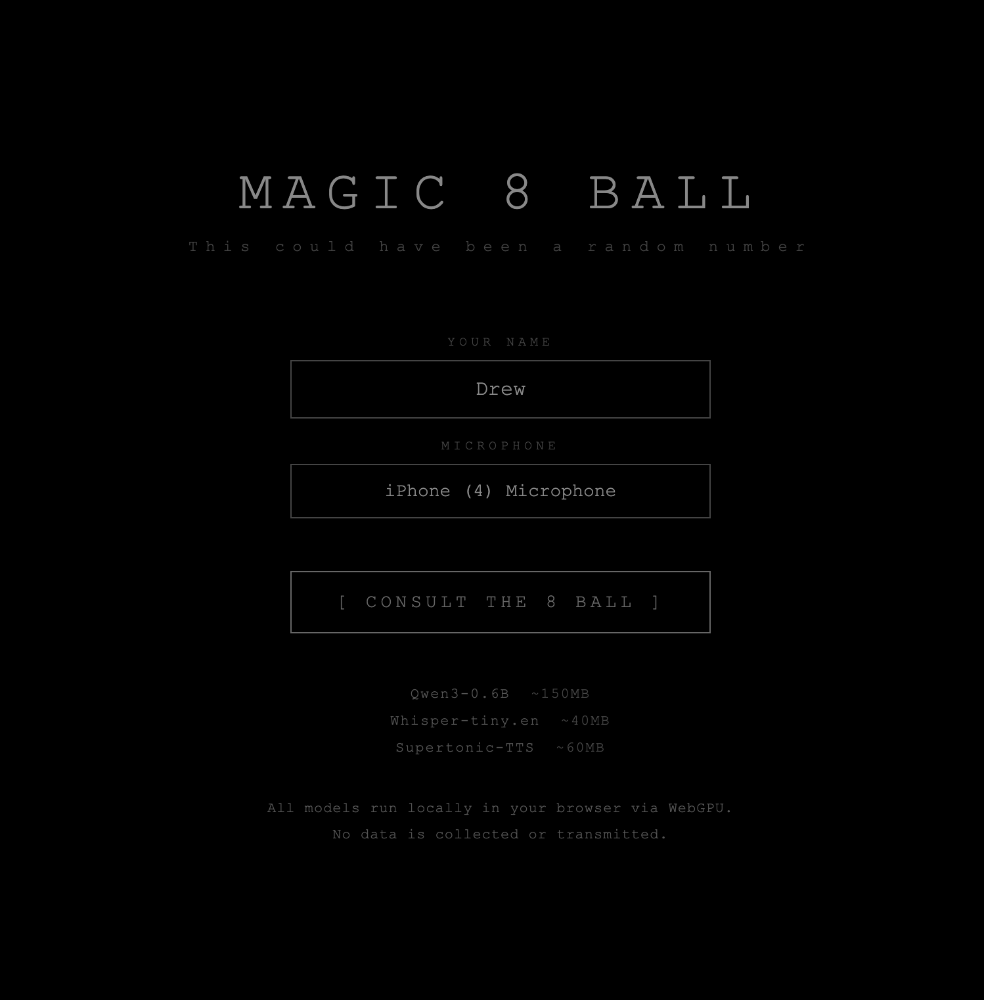
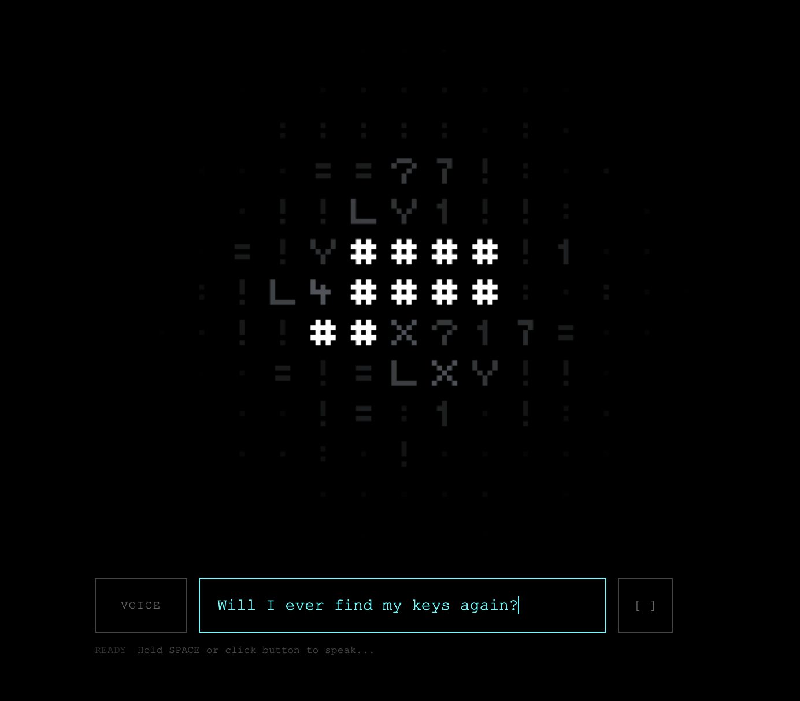
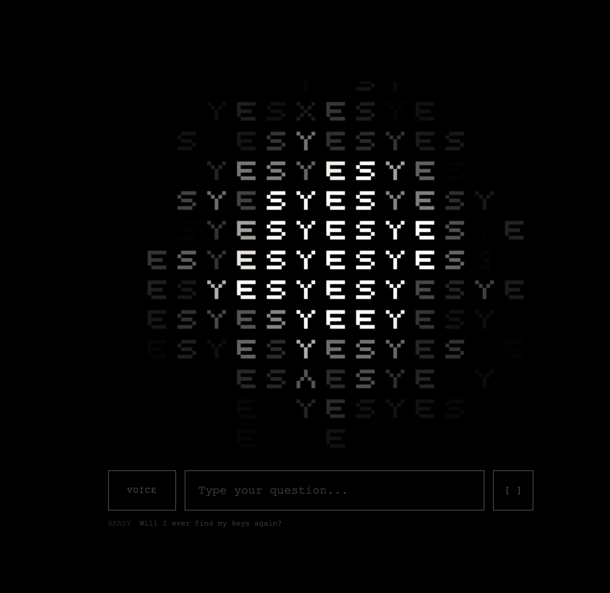

# Magic 8 Ball 🎱

A fully on-device Magic 8 Ball with voice interaction. Ask your question by speaking or typing, and receive a mystical response—complete with text-to-speech and spooky shader effects.
<div align="center">
  
  
  
</div>
## Tech Stack

All AI runs locally in your browser via WebGPU. **Nothing leaves your device.**

| Model | Purpose | Size |
|-------|---------|------|
| **Qwen3-0.6B** | LLM for generating responses | ~150MB |
| **Whisper-tiny.en** | Speech-to-text | ~40MB |
| **Supertonic-TTS** | Text-to-speech | ~60MB |

Built with Vite, uses [Hugging Face Transformers.js](https://huggingface.co/docs/transformers.js) and [ONNX Runtime Web](https://onnxruntime.ai/).

## Usage

```bash
npm install
npm run dev
```

Requires a WebGPU-capable browser (Chrome 113+, Edge 113+).
